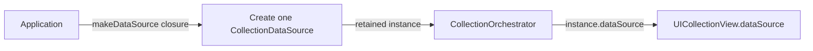
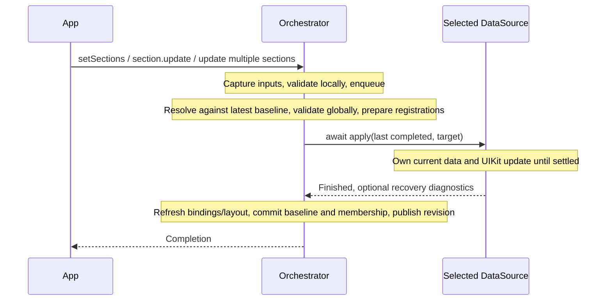
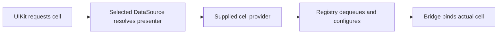
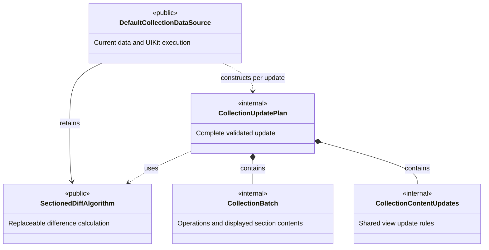
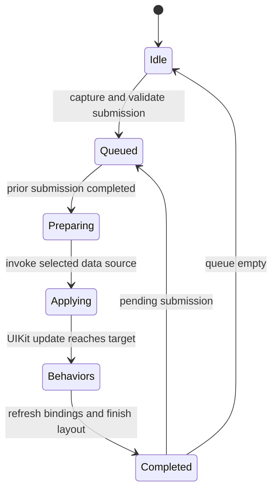

# Architecture

Parade presents stable business sections through captured display versions. The
application creates the collection view. `CollectionOrchestrator` installs and owns
its `UICollectionViewCompositionalLayout`, data source and delegate. This breaking
version has one layout contract and no Flow-layout compatibility path.

A `SectionPresenter` is a MainActor reference type. It owns module state and a
`SectionUpdateContext`, and captures a `SectionPresentation`. The output protocol
requires cells, supplementary views and `makeLayout(in:) -> NSCollectionLayoutSection`.
`DefaultSectionPresentation` is a convenience implementation. `CapturedSection` erases
concrete output types while keeping content and layout from the same capture.

Construction chooses the update implementation explicitly:

The factory receives the collection view and Parade's cell/supplementary providers.
It returns either `DefaultCollectionDataSource`, `DiffableCollectionDataSource`, or an
application implementation. There is no backend-type branch in the orchestrator.

## Public roles

| Role | Owns | Does not own |
| --- | --- | --- |
| SectionPresenter | Stable module identity, business state, requests/listeners, update context, capture of display output | Collection indexing, other modules, UIKit execution |
| SectionPresentation | Immutable cell/supplementary output and inputs for native section layout construction | Live business mutations, collection membership |
| CellPresenter | One occurrence's identity, content comparison, concrete cell configuration and behaviors | Collection indexing or other sections |
| SupplementaryPresenter | Reusable-view identity, kind/item address, configuration and behaviors | Layout creation or cell lifetime |
| CollectionOrchestrator | Module attachment, operation queue, last completed baseline, compositional layout provider, registry, delegate bridge, completion | Current data-source positions, diff execution or UIKit batches |
| CollectionDataSource | Current section/item/layout queries, native data source, applying a captured target through UIKit | Business state, submission queue, delegate or view-creation policy |
| DefaultCollectionDataSource | Current stage data and indexes, sectioned diff/planning, UIKit batches and reload recovery | Public completion or business events |
| DiffableCollectionDataSource | Native snapshots and positions, logical/native identity mapping, current and previous presenter lookup during apply | Parade's structural planner or its algorithm slot |

## Source ownership

- `DataSource/Default/` contains the default data source, `CollectionUpdatePlan`,
  `CollectionBatch`, and plan validation. A batch directly owns the section contents
  it presents; no separate identity structure or presenter-binding stage is built.
  These UIKit update rules are not part of the replaceable algorithm contract.
- `DataSource/` contains the shared protocol, captured composition and input validation,
  shared content-update rules, and the Apple implementation. Both implementations
  consume these types, so they do not belong exclusively to the default source.
- `Diff/` contains the public algorithm/input/result contracts, the default algorithm,
  and its shared identity-position lookup. It does not contain UIKit batch planning.
- `UIKit/` contains the fixed view/delegate bridge; `Registration/` owns native
  registration and dequeue.

The default implementation has three roles: the data source executes updates,
`CollectionUpdatePlan` constructs a complete validated update, and `CollectionBatch`
contains one batch's operations and its actual data. Plan validation is an extension
of that value, not another service or state owner.

## Presenter composition

Sections are classes conforming to a protocol; no framework base class is required.
An App Store section can transform one business model into two, four, or any number
of cells. A chat section can hold heterogeneous text, image, and notice presenters.
The same two layers support both cases. Applications establish membership with `setSections`. Sections capture and submit
local changes with `update()`. `orchestrator.update([first, second])` captures several
sections atomically. Data-source implementations receive a full captured
`CollectionComposition` built against the latest completed baseline.

`AnyCellPresenter` and `AnySupplementaryPresenter` erase at the heterogeneous array
boundary. They retain an internal `underlyingPresenter`, along with captured
identity, address, and registration compatibility information. Basic operations
use internal protocol-extension bridges: configuration and behavior binding restore
the concrete view type, while equality checks the concrete type and casts the other presenter to `Self`.
The erasers store no forwarding closures. `DiffableElement: Equatable` supplies the
shared identity/equality contract. The erasers compare the same concrete presenter
type through standard `==`; concrete presenters can synthesize equality or provide
an ordinary `static func ==` for presentation fields while excluding behavior closures.
Identity, equality, captured data, and diff planning have no MainActor requirement.
The erasers have no `Sendable` conformance.
The public algorithm remains generic over section and item types. Its change result
is Sendable. The default update plan carries captured presenters and is not Sendable;
its constructor is synchronous and nonisolated. No unchecked sendability is applied
to UIKit or AnyHashable.

`CellPresenter` requires identity, a concrete cell type, visual content comparison,
configuration, and replaceable behavior binding. Selection, highlighting, display
observation, and context menus are independent opt-in protocols refining that core:
`CellSelectionHandling`, `CellHighlightHandling`, `CellDisplayObserving`, and
`CellContextMenuProviding`. They reuse the presenter's concrete `Cell` type.
The core protocol does not inherit them. `AnyCellPresenter` retains the original
value as an internal `any CellPresenter`, including when constructed through a
generic function constrained only to `CellPresenter`. It does not enumerate optional
capabilities or cache their callbacks. Event consumers query the capability from
the actual view binding; extensions alongside each capability restore the concrete
cell type before invoking its requirements. Incompatible cells are ignored.
An internal capability and its consumer can be added without changing the eraser.
This does not expose the original value or an event plugin API to applications.

Supplementary views follow the same boundary: `SupplementaryPresenter` owns
identity, element kind/item address, configuration, and behavior binding.
`SupplementaryDisplayObserving<View>` separately opts into visibility callbacks.
`AnySupplementaryPresenter` retains an internal `any SupplementaryPresenter` and
does not cache or forward display callbacks. UIKit consumers query the observer
from the actual view binding, and the capability extension restores the concrete
`View` type. Same-named methods without conformance are not invoked.

The existing public `shouldSelect`, `shouldDeselect`, and `shouldHighlight` queries
are extensions alongside their capability protocols. They read the underlying
policy when queried instead of capturing a Boolean at erasure time. Policy getters
should be cheap and free of side effects. Capability casts happen when consumed.

Absent capabilities mean no presenter callbacks and no context menu. Selection,
deselection, and highlighting policy defaults remain `true`, so collection-wide
event handling does not require a presenter-level selection handler. Opted-in
selection/highlighting protocols also default their policies to `true` and their
callbacks to no-ops; display callbacks default to no-ops. Context menu providers
must implement their configuration method and may return `nil` for a given request.

## Isolation boundary

Cell/supplementary presenter and capability protocols place MainActor on specific UI requirements:
configuration, behavior binding, interaction-policy reads, and event callbacks.
Their conforming types are not implicitly isolated as a whole. The `SectionPresenter`
contract itself is MainActor-isolated because it owns mutable state.

`SectionPresenter.capturePresentation()` is read on MainActor, and
`CapturedSection.init(capturing:)` captures content and binds the native layout method there. Supplementary `elementKind` is also
read there because UIKit's header/footer constants are isolated in the SDK;
`AnySupplementaryPresenter.init(_:)` captures that value once. Identity itself,
cell erasure, captured section reconstruction, validation, and the complete differ
are ordinary synchronous value operations. `CollectionComposition.empty` creates
an empty value on access rather than sharing a non-Sendable global instance.

Orchestrator state, the bridge's view records, registration, and UIKit execution
remain MainActor-owned. The bridge's immutable binding values need no isolation.
Pure planning can be performed in another actor using values created within that
actor, without declaring erased presenters Sendable or moving UIKit views.
Both supplied data sources execute on MainActor. The default constructs its update
plan synchronously; the Apple adapter awaits native snapshot application. Neither path
adds background scheduling. Native integer identifiers satisfy the SDK's Sendable
identity constraints without declaring erased presenters or AnyHashable Sendable.

## Three independent comparisons

1. **Identity:** Is this the same logical display occurrence?
2. **Registration compatibility:** Can the same concrete reusable view represent it?
3. **Content equality:** Does the existing view need visual reconfiguration?

Same identity and different registration means replacement. Same registration and
changed content means reconfiguration. Equal content still installs current behavior
closures; do not include action closures in content equality merely to force this.
`setBehaviors` should replace bindings rather than append new targets on each update.
When presenters share a view type, each must overwrite or clear the bindings it
owns. A default no-op does not remove previously installed actions. Behavior binding
therefore remains a base requirement with explicit cleanup responsibility.
Transient view animation state need not become domain state. Persistent expansion,
selection, and similar application decisions should flow from application state.

Section IDs are unique. Cell IDs are globally unique occurrence IDs, allowing actual
cross-section moves. Supplementary identity is local to section and kind; its UIKit
address is `(sectionId, elementKind, itemIndex)`. Invalid duplicates or placements
are rejected before UIKit is touched. Native hashable equality applies to erased IDs;
use domain Id wrappers when otherwise-equal values represent different identities.

## Applying a submission

`CollectionComposition` and `CapturedSection` expose the existing captured input to
external implementations. Callers still submit section presenters; they do not need
to build a public snapshot. The composition is complete, including identity, content, supplementary information and captured layout construction. UIKit callbacks and public position queries read the
selected data source, never the orchestrator's last completed baseline.

For a cell request, the path is deliberately small:

The bridge also handles UIKit delegate callbacks. It retains bindings on actual
views so an old disappearing view keeps the right presenter for its end-display
callback. Events reach the presenter's application callback; business state changes
produce a new submission. Cell and supplementary presenters receive no collection
context; section modules own their explicit `SectionUpdateContext`.

## Default implementation's planning boundary

`CollectionComposition` validates identities and supplementary addresses in its
constructor while building immutable presenter lookups. Validation finishes each
section before proceeding to the next, preserving the first reported error and both
conflict positions. Submissions validate locally known inputs before entering the queue;
complete targets are validated against the execution-time baseline. Only successful
compositions reach the data source, including reload targets. There is no separate
input-index object or generic dictionary builder.

`CollectionPositions` is an internal calculation helper shared by the algorithm and
plan validation. It maps identities to positions and rejects duplicate section/item
identities with source/target coordinates. It owns no applied state. Input composition
validation keeps its own traversal and diagnostics because supplementary constraints
and error precedence belong to the captured composition.

`SectionedDiffAlgorithm` is the public computation boundary. It receives two arrays
of `DiffableSection`, including their items. Sections supply identity and comparison
of their own content; items use the existing `DiffableElement` identity and equality.
`CapturedSection` adapts the captured presenters without changing presenter protocols.
Its own-content comparison covers supplementary identity, address and content, excluding cells.

`SectionedChanges` contains section/item inserts, deletes, moves and updates in the
original source/target coordinates. Item membership lists include items inside new
and deleted sections. A retained item crossing section identities is a move, including
transfers between deleted and inserted sections. A move may also have a content update.
The result contains no UIKit batches, intermediate data or reload/reconfigure decisions.

`SectionedDiff` is the default implementation. It matches unique IDs and uses a greedy
next-unconsumed-source policy, with expected linear matching work/storage plus input
hashing/comparison costs, and no minimal-move guarantee. `CollectionOrchestrator(collectionView:diffAlgorithm:)` accepts any implementation.
The algorithm runs synchronously; the input's comparison rules still define content equality.

`CollectionUpdatePlan` invokes the supplied algorithm and validates its result before
using any coordinates. It constructs up to three structural batches with complete
`CapturedSection` values. Each retained section keeps its source supplementary metadata and captured layout,
and each retained cell keeps its source presenter, even when moved into a new section.
Inserted identities use target content. Final content edits use target coordinates.

Each `CollectionBatch` stores operations and the exact contents the data source must
expose during those operations. There is no identity-only section model, outer stage
wrapper, or subsequent presenter reconstruction. `CollectionUpdatePlan+Validation`
replays batch operations against the previous contents and compares identities to
verify membership, coordinates, conflicts, move completeness, and final order.
Content comparison completeness remains the algorithm's responsibility.

The plan preserves supplied retained-identity moves and never recalculates a default
diff. An inserted section may need an extra move from its temporary insertion position.
Planning owns no applied state, queue, collection view, or recovery policy. A throwing
constructor cannot return a partially validated plan. Even an empty plan installs the
newest target presenters before the shared behavior refresh.

The default data source owns stage data, indexes, UIKit execution and reload recovery.
Algorithm errors or invalid results recover by reloading the validated target before
the first batch. The orchestrator owns the completed baseline and public completion.

`CollectionContentUpdates` holds the fixed view-update rules shared by both supplied
implementations. The default supplies its algorithm's content-change results; the
Apple adapter compares captured content directly and marks native snapshot reloads
or reconfigurations. Compatible supplementary updates configure visible views and
invalidate layout. Supplementary topology or registration changes reload the section.
The Apple adapter has no Parade structural stages: native snapshot APIs determine
positions, while target and previous presenter lookups resolve native requests until
apply completes. Removed identity mappings and the previous composition are released
after completion.

## Update lifecycle

Accepted submissions are FIFO. `setSections` captures every supplied module at submission
for possible attachment; execution decides which captures are needed. `update` captures
the selected modules' presentation outputs. Existing modules
in a membership/reorder operation retain their latest completed content. Later live
state changes cannot change a captured version's arrays or UIKit counts. Presenter
values and layout business inputs must remain immutable after submission; the
framework cannot deep-copy arbitrary reference models captured inside user code.

The update plan contains up to three nonempty structural batches: add destination sections,
change/transfer items while section coordinates are stable, then delete/reorder
sections. No-op structure creates no batch; ordinary item changes fit in one batch.
The unique-Id Heckel move policy does not promise a minimal move count.

In the default implementation, each UIKit stage installs its resulting structure in the data source.
Existing cell content stays associated with the source version during structural
movement. After structure settles, content/registration changes are applied in a
separate phase to avoid unsafe reload/move combinations. Supplementary topology or
registration changes reload their section; compatible supplementary content is
configured on the existing view and invalidates layout. This is a deliberate UIKit
tradeoff: topology changes can replace otherwise unchanged cells in that section.

The orchestrator asks its `ViewRegistry` to prepare registration objects before
executing UIKit callbacks. The registry opens the underlying presenter's generic
type and owns preparation, caching, and dequeue directly; erasers do not route calls
back into it. The native cell handler uses the current erased presenter supplied by
UIKit, and supplementary configuration uses the presenter supplied for that dequeue.
Preparing registrations lazily inside the first dequeue callback is not sufficient,
even if later dequeues reuse the registration.
Only native class registration is supported. The framework derives registration
from the presenter's concrete view type and the supplementary element kind;
presenters do not expose registration configuration.

Display callbacks use bindings attached to the actual view. A removal or registration
change leaves the old binding available for its final `didEndDisplaying`. Visibility
does not imply entity insertion/deletion or own asynchronous request lifetime. New
compatible behaviors are also installed when a prepared cell enters display.
UIKit may display a previously prepared cell again without a new dequeue; see
[Apple's cell lifecycle discussion](https://developer.apple.com/videos/play/wwdc2021/10252/).

`sectionId(at:)`, `cellPresenter(at:)`, and identity/position queries use UIKit's current
stage. The installed compositional provider asks the selected data source for
`layoutSection(at:environment:)`, which maps that stage's section index to its captured
layout. The page does not route layouts through its own latest module array.
`supplementaryPresenter(ofKind:at:)` likewise queries the stage's current presenter.
`appliedRevision` increments and `onDidApply` fires only after the entire submission.
Enqueuing from callbacks is supported. Cancelling a task awaiting `setSections` or
`update` leaves the accepted operation in the queue and does not cancel or roll back
a UIKit transaction.

## Error recovery

Validation errors describe invalid input; the orchestrator owns recovery. Duplicate
IDs or invalid supplementary placements reject the whole submission, including
explicit reload submissions. Parade keeps the current display and reports failure
without advancing `appliedRevision`. Later valid submissions continue from the last
successfully applied composition. It does not guess which duplicate is authoritative.

Before the first structural batch, the default implementation replays the complete proposed plan to
check identities, coordinates, conflicts, intermediate counts and final structure.
Each batch already contains its intermediate presenter composition. A failed plan
reloads the independently validated target before any batch has started.
Only after execution completes does the queue update its baseline, advance the
revision, emit `onDidApply`, and complete successfully. `setSections` validates member
IDs and distinct update contexts at submission. Content validation waits until execution
resolves membership and selects accepted versions or attachment captures; an unused
capture cannot reject a reorder even while initial attachment is pending. Content errors
therefore settle in FIFO order. Local `update` operations always use their captures, so
they validate those outputs before enqueueing. Every complete target is validated before
UIKit changes. Neither validation failure commits a target.

`CollectionDiagnostic` carries a reason, recovery action and, for invalid input,
the relevant positions. `onDiagnostic` and the diagnostic logger run after active
submission state settles. Diagnostics raised in UIKit data-source callbacks are
buffered, so the application can submit again without reentering a dequeue. A
successful reload recovery produces a diagnostic and successful completion; it is
distinct from rejecting an invalid target.

Missing cell content produces an inert reusable cell. Missing supplementary content
produces an inert reusable view registered for the layout-requested kind. Both use
UIKit dequeue APIs, including for previously unknown supplementary kinds, following
[Apple's supplementary dequeue contract](https://developer.apple.com/documentation/uikit/uicollectionview/dequeuereusablesupplementaryview(ofkind:withreuseidentifier:for:)).
Fallback views have no presenter binding and do not forward business events. Layout
space may remain empty until a subsequent update/reload supplies valid content.

These paths handle invalid compositions and planner/presenter lookup failures.
They do not intercept traps or exceptions raised by application-provided layout,
cell construction, configuration or event callbacks.

## What the source review contributed

| Project | Relevant design lesson | Parade choice |
| --- | --- | --- |
| [ReactiveCollectionsKit](https://github.com/jessesquires/ReactiveCollectionsKit) | Typed cell/supplementary models assembled by section, central driver | Keep these roles as presenters with our own update backend |
| [Epoxy](https://github.com/airbnb/epoxy-ios/blob/master/Sources/EpoxyCollectionView/Models/ItemModel/AnyItemModel.swift) | Separate content configuration and behavior binding | Explicit `configure` and `setBehaviors` |
| [Carbon](https://github.com/ra1028/Carbon/blob/master/Sources/Updaters/UICollectionViewUpdater.swift) | Its empty-diff path still installs data and can render visible components | No-op visual content cannot suppress new actions |
| [ComposedUI](https://github.com/composed-swift/ComposedUI) | Sections compose typed configuration and optional interaction capabilities | First-class section protocol; app still composes state |
| [Listable](https://github.com/square/Listable/blob/main/ListableUI/Sources/Item/ItemContentCoordinator.swift) | Entity callbacks and view visibility callbacks are distinct | Display callbacks have no implied business/task lifetime |
| [IGListKit](https://github.com/Instagram/IGListKit/blob/main/Source/IGListKit/IGListAdapterUpdater.m) | Inflight update state owns when the next transaction can begin | Explicit serialized submission queue |
| [DifferenceKit](https://github.com/ra1028/DifferenceKit/blob/master/Sources/Extensions/UIKitExtension.swift) | A valid diff still needs staged UIKit operations and per-stage data | Separate pure planning from UIKit execution |

These are selective design references, not dependencies or an assertion of feature
parity. Parade's tests cover its own behavior; no comparative performance claim
is made for the complete update pipeline.

## Initial limits

- iOS 16 minimum, Swift tools/language mode 6.0; the installed toolchain is newer.
- Collection views are application-owned; the orchestrator installs the compositional layout. Select a data source in the
  factory; do not replace it or the delegate during use. Use `scrollViewDelegate` for
  scroll forwarding.
- No network/request ownership, layout DSL, height cache, navigation, prefetch API,
  drag/drop, interactive reordering, or automatic IM scroll anchoring is provided.
- Pending updates are not coalesced; every accepted update has its own completion.
- Cells and supplementary views must support class construction. Nib/XIB loading
  is not supported.
- Tests establish structural and UIKit functional correctness for their covered
  scenarios. They do not establish device performance or animated visual quality.

## Section operations and attachment

Each section owns one stable update context. The collection retains attached module
instances; the context weakly references its attachment and never retains the collection.
Initial attachment completes before `update()` is available. Removed modules are
disconnected. Replacing an instance, even with the same business ID, invalidates its
queued updates. A context is reserved before UIKit starts, preventing simultaneous
attachment to two collections during suspension.

| Operation | Inputs captured on submission | Effect on the execution-time baseline |
| --- | --- | --- |
| `setSections` | Member identities/order and output for any instance that needs attachment at execution | Preserve surviving instances' accepted content; add/remove/reorder members |
| `section.update()` | One module's display output and attachment identity | Replace that module's content and layout |
| `orchestrator.update(_:)` | Several modules' outputs and attachment identities | Replace them together, supporting cross-section cell transfers |

Membership changes preserve accepted versions of sections still attached at execution.
Each supplied instance is also captured at submission: if an earlier queued operation
removes it, reattachment uses that capture. An unused capture cannot reject or overwrite
a surviving instance's accepted content. Each operation builds and globally validates a
complete target when it reaches the head of the queue. A failed operation settles its
receipt, preserves the baseline and allows subsequent operations to execute.

An unbounded `AsyncStream` carries complete submissions. One MainActor consumer awaits
execution of each submission before reading the next. MainActor alone would not provide
this guarantee across suspension. Cancellation of a caller does not retract an accepted
operation. Stream enqueue failure is an explicit error; accepted operations are not coalesced.

## Captured layout stages

Layout construction is mandatory. The framework binds the output's typed method at
capture time; it never discovers layout support through `as?` or an enum of layout families.
`CapturedSection.replacingCells` preserves the captured layout identity when constructing
structural stages. Retained sections use source layout/supplementary metadata during
manual structural stages; inserted sections use their captured target metadata. The final
content phase installs target content and layout together. Builders must produce a valid
native layout for their section, including empty sections and intermediate item counts.

The default data source installs each stage before UIKit reads it and invalidates the
layout as part of the appropriate batch. A new captured layout version schedules layout
work even when cells compare equal. Layout closures are not compared for equality.
The native data source resolves section positions through its current native snapshot,
uses target presentations with previous-version fallback for removed identities during
apply, then invalidates and lays out the settled target before returning.

Captured business inputs are stable; UIKit's layout environment remains current.
A layout closure must not reread the live module for those business inputs. Custom data
sources must expose the same content/layout stage and invalidate when installing a new
layout version. A provider alone does not cause layout-only changes to take effect.

Cell reuse and section lifetime remain separate. Parade does not recycle business
section instances based on viewport visibility, cancel application requests automatically,
or provide a global event bus. Modules/application owners manage requests and cancellation;
explicit closures/delegates carry business events. Pagination and member removal bound
retained business state.
